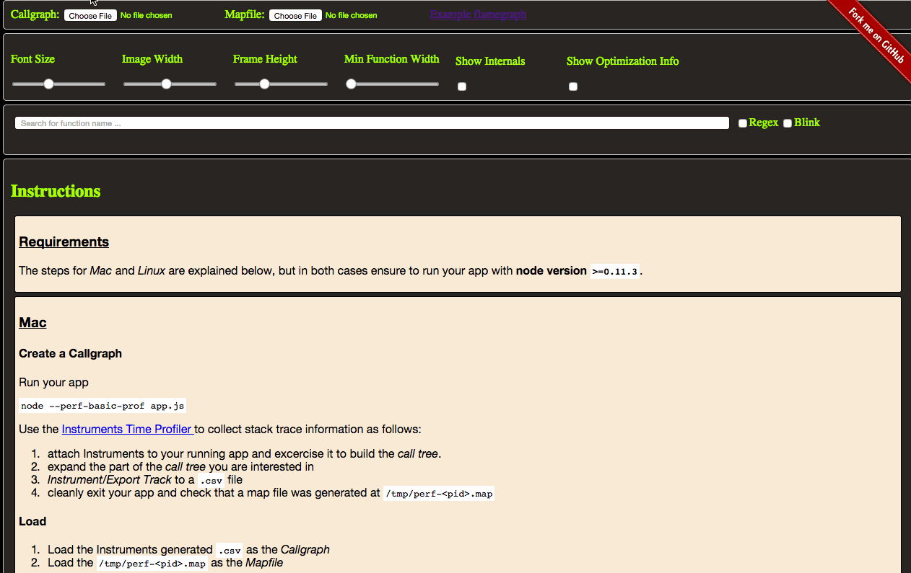

# flamegraph [](http://travis-ci.org/thlorenz/flamegraph)

[](https://ci.testling.com/thlorenz/flamegraph)

Generates flamegraphs with Node.js or in the browser.

```
cat dtrace.txt | flamegraph -t dtrace > flamegraph.svg
```

[Try the online flamegraph app](http://thlorenz.github.io/flamegraph/web/)

[](http://thlorenz.github.io/flamegraph/web/)

## Installation

    npm install flamegraph

## Usage

**Requires Node.js version `0.11.13` or higher**.

**NOTE** currently not working with cpu profiles saved from Chrome DevTools due to a format change. For more info and to
help fixing it please [see this issue](https://github.com/thlorenz/flamegraph/issues/21).

```
flamegraph <options>

Generates a flamegraph from the callgraph data of the given `inputtype` that is streamed into it.

OPTIONS:

  --inputtype -t      the type of callgraph 'perf | cpuprofile'

  --file -f           the input csv file (may also be piped)
  --output -o         the output svg file (may also be displayed in stdout)
  --map -m            a mapping / symbols file, named perf-<pid>.map, generated using node --perf-basic-prof

  --fonttype          font family used                  default: 'Verdana'
  --fontsize          base text size                    default: 12
  --imagewidth        max width, pixels                 default: 1200
  --frameheight       max height is dynamic             default: 16.0
  --fontwidth         avg width relative to fontsize    default: 0.59
  --minwidth          min function width, pixels        default: 0.1
  --countname         what are the counts in the data?  default: 'samples'
  --colors            color theme                       default: 'hot'
  --bgcolor1          background color gradient start   default: '#eeeeee'
  --bgcolor2          background color gradient stop    default: '#eeeeb0'
  --timemax           (override the) sum of the counts  default: Infinity
  --factor            factor to scale counts by         default: 1
  --hash              color by function name            default: true
  --titletext         centered heading                  default: 'Flame Graph'
  --nametype          what are the names in the data?   default: 'Function:'

  --removenarrows     removes narrow functions instead of adding a 'hidden' class   default: true
  --internals         include internal functions        default: false
  --optimizationinfo  include optimization indicators   default: false

  --help      -h  print this help message

EXAMPLE:

  cat dtrace.txt | flamegraph -t dtrace > flamegraph.svg
```

The input data needs to be generated as follows:

- [use perf on linux](https://github.com/thlorenz/flamegraph/blob/master/generate-perf-data.md)
- [use dtrace on OSX](https://github.com/thlorenz/cpuprofilify#instructions)

## API

<!-- START docme generated API please keep comment here to allow auto update -->
<!-- DON'T EDIT THIS SECTION, INSTEAD RE-RUN docme TO UPDATE -->

<div>
<div class="jsdoc-githubify">
<section>
<article>
<div class="container-overview">
<dl class="details">
</dl>
</div>
<dl>
<dt>
<h4 class="name" id="flamegraph"><span class="type-signature"></span>flamegraph<span class="signature">(arr, opts)</span><span class="type-signature"> &rarr; {string}</span></h4>
</dt>
<dd>
<div class="description">
<p>Converts an array of call graph lines into an svg document.</p>
</div>
<h5>Parameters:</h5>
<table class="params">
<thead>
<tr>
<th>Name</th>
<th>Type</th>
<th class="last">Description</th>
</tr>
</thead>
<tbody>
<tr>
<td class="name"><code>arr</code></td>
<td class="type">
<span class="param-type">Array.&lt;string></span>
</td>
<td class="description last"><p>input lines to render svg for</p></td>
</tr>
<tr>
<td class="name"><code>opts</code></td>
<td class="type">
<span class="param-type">Object</span>
</td>
<td class="description last"><p>objects that affect the visualization</p>
<h6>Properties</h6>
<table class="params">
<thead>
<tr>
<th>Name</th>
<th>Type</th>
<th class="last">Description</th>
</tr>
</thead>
<tbody>
<tr>
<td class="name"><code>profile</code></td>
<td class="type">
<span class="param-type">Object</span>
</td>
<td class="description last"><p>options passed to cpuprofilify @see <a href="https://github.com/thlorenz/cpuprofilify#parameters">cpuprofilify.convert params</a></p></td>
</tr>
<tr>
<td class="name"><code>fonttype</code></td>
<td class="type">
<span class="param-type">string</span>
</td>
<td class="description last"><p>type of font to use               default: <code>'Verdana'</code></p></td>
</tr>
<tr>
<td class="name"><code>fontsize</code></td>
<td class="type">
<span class="param-type">number</span>
</td>
<td class="description last"><p>base text size                    default: <code>12</code></p></td>
</tr>
<tr>
<td class="name"><code>imagewidth</code></td>
<td class="type">
<span class="param-type">number</span>
</td>
<td class="description last"><p>max width, pixels                 default: <code>1200</code></p></td>
</tr>
<tr>
<td class="name"><code>frameheight</code></td>
<td class="type">
<span class="param-type">number</span>
</td>
<td class="description last"><p>max height is dynamic             default: <code>16.0</code></p></td>
</tr>
<tr>
<td class="name"><code>fontwidth</code></td>
<td class="type">
<span class="param-type">number</span>
</td>
<td class="description last"><p>avg width relative to fontsize    default: <code>0.59</code></p></td>
</tr>
<tr>
<td class="name"><code>minwidth</code></td>
<td class="type">
<span class="param-type">number</span>
</td>
<td class="description last"><p>min function width, pixels        default: <code>0.1</code></p></td>
</tr>
<tr>
<td class="name"><code>countname</code></td>
<td class="type">
<span class="param-type">string</span>
</td>
<td class="description last"><p>what are the counts in the data?  default: <code>'samples'</code></p></td>
</tr>
<tr>
<td class="name"><code>colors</code></td>
<td class="type">
<span class="param-type">string</span>
</td>
<td class="description last"><p>color theme                       default: <code>'hot'</code></p></td>
</tr>
<tr>
<td class="name"><code>bgcolor1</code></td>
<td class="type">
<span class="param-type">string</span>
</td>
<td class="description last"><p>background color gradient start   default: <code>'#eeeeee'</code></p></td>
</tr>
<tr>
<td class="name"><code>bgcolor2</code></td>
<td class="type">
<span class="param-type">string</span>
</td>
<td class="description last"><p>background color gradient stop    default: <code>'#eeeeb0'</code></p></td>
</tr>
<tr>
<td class="name"><code>timemax</code></td>
<td class="type">
<span class="param-type">number</span>
</td>
<td class="description last"><p>(override the) sum of the counts  default: <code>Infinity</code></p></td>
</tr>
<tr>
<td class="name"><code>factor</code></td>
<td class="type">
<span class="param-type">number</span>
</td>
<td class="description last"><p>factor to scale counts by         default: <code>1</code></p></td>
</tr>
<tr>
<td class="name"><code>hash</code></td>
<td class="type">
<span class="param-type">boolean</span>
</td>
<td class="description last"><p>color by function name            default: <code>true</code></p></td>
</tr>
<tr>
<td class="name"><code>titletext</code></td>
<td class="type">
<span class="param-type">string</span>
</td>
<td class="description last"><p>centered heading                  default: <code>'Flame Graph'</code></p></td>
</tr>
<tr>
<td class="name"><code>nametype</code></td>
<td class="type">
<span class="param-type">string</span>
</td>
<td class="description last"><p>what are the names in the data?   default: <code>'Function:'</code></p></td>
</tr>
</tbody>
</table>
</td>
</tr>
</tbody>
</table>
<dl class="details">
<dt class="tag-source">Source:</dt>
<dd class="tag-source"><ul class="dummy">
<li>
<a href="https://github.com/thlorenz/flamegraph/blob/object-graph/index.js">index.js</a>
<span>, </span>
<a href="https://github.com/thlorenz/flamegraph/blob/object-graph/index.js#L16">lineno 16</a>
</li>
</ul></dd>
</dl>
<h5>Returns:</h5>
<div class="param-desc">
<p>svg                 the rendered svg</p>
</div>
<dl>
<dt>
Type
</dt>
<dd>
<span class="param-type">string</span>
</dd>
</dl>
</dd>
<dt>
<h4 class="name" id="flamegraph::fromStream"><span class="type-signature"></span>flamegraph::fromStream<span class="signature">(stream, opts)</span><span class="type-signature"> &rarr; {ReadableStream}</span></h4>
</dt>
<dd>
<div class="description">
<p>Converts a stream of call graph lines into an svg document.
Not truly streaming, concats all lines before processing.</p>
<p><strong>Example</strong>:</p>
<pre><code class="lang-js">var fromStream = require('flamegraph/from-stream');
fromStream(process.stdin, opts).pipe(process.stdout);</code></pre>
</div>
<h5>Parameters:</h5>
<table class="params">
<thead>
<tr>
<th>Name</th>
<th>Type</th>
<th class="last">Description</th>
</tr>
</thead>
<tbody>
<tr>
<td class="name"><code>stream</code></td>
<td class="type">
<span class="param-type">ReadableStream</span>
</td>
<td class="description last"><p>that will emit the call graph lines to be parsed</p></td>
</tr>
<tr>
<td class="name"><code>opts</code></td>
<td class="type">
<span class="param-type">Object</span>
</td>
<td class="description last"><p>same as <code>flamegraph</code></p></td>
</tr>
</tbody>
</table>
<dl class="details">
<dt class="tag-source">Source:</dt>
<dd class="tag-source"><ul class="dummy">
<li>
<a href="https://github.com/thlorenz/flamegraph/blob/object-graph/from-stream.js">from-stream.js</a>
<span>, </span>
<a href="https://github.com/thlorenz/flamegraph/blob/object-graph/from-stream.js#L12">lineno 12</a>
</li>
</ul></dd>
</dl>
<h5>Returns:</h5>
<div class="param-desc">
<p>stream that emits the lines of generated svg</p>
</div>
<dl>
<dt>
Type
</dt>
<dd>
<span class="param-type">ReadableStream</span>
</dd>
</dl>
</dd>
<dt>
<h4 class="name" id="flamegraph::svg"><span class="type-signature"></span>flamegraph::svg<span class="signature">(collapsedLines, opts)</span><span class="type-signature"> &rarr; {string}</span></h4>
</dt>
<dd>
<div class="description">
<p>Creates a context from a call graph that has been collapsed (<code>stackcollapse-*</code>) and renders svg from it.</p>
</div>
<h5>Parameters:</h5>
<table class="params">
<thead>
<tr>
<th>Name</th>
<th>Type</th>
<th class="last">Description</th>
</tr>
</thead>
<tbody>
<tr>
<td class="name"><code>collapsedLines</code></td>
<td class="type">
<span class="param-type">Array.&lt;string></span>
</td>
<td class="description last"><p>callgraph that has been collapsed</p></td>
</tr>
<tr>
<td class="name"><code>opts</code></td>
<td class="type">
<span class="param-type">Object</span>
</td>
<td class="description last"><p>options</p></td>
</tr>
</tbody>
</table>
<dl class="details">
<dt class="tag-source">Source:</dt>
<dd class="tag-source"><ul class="dummy">
<li>
<a href="https://github.com/thlorenz/flamegraph/blob/object-graph/lib/svg.js">lib/svg.js</a>
<span>, </span>
<a href="https://github.com/thlorenz/flamegraph/blob/object-graph/lib/svg.js#L23">lineno 23</a>
</li>
</ul></dd>
</dl>
<h5>Returns:</h5>
<div class="param-desc">
<p>svg</p>
</div>
<dl>
<dt>
Type
</dt>
<dd>
<span class="param-type">string</span>
</dd>
</dl>
</dd>
</dl>
</article>
</section>
</div>

*generated with [docme](https://github.com/thlorenz/docme)*
</div>
<!-- END docme generated API please keep comment here to allow auto update -->

## Kudos

This library is an adaptation of @brendangregg's [FlameGraph perl scripts](https://github.com/brendangregg/FlameGraph).

## License

MIT
